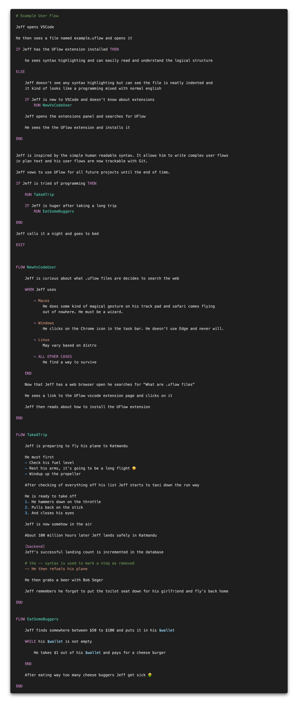
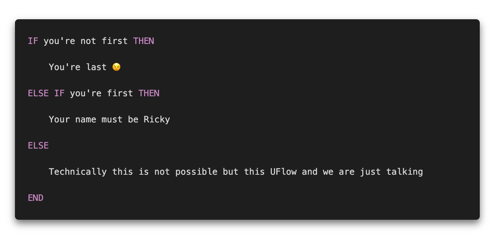

# uflow
Uflow is a simple non-executable human readable language used to describe user flows

## Purpose
The purpose of UFlow is to make writing user flows and instructive documents more concise and 
same logic control flow that are used in true programing language. UFlow is not a replacement for
Markdown.

## Example

## Keywords

### IF
Start of an if statement directly followed by a statement that can be read as being true or false.
If the statement is read as being true then the the following statements should be read until
the **END** or **ELSE** keyboard is encountered.
 
 

### THEN
An optional ending of an **IF** statement
 
 

### ELSE
Used in combination with an **IF** statement. If an **IF** statement is false then the statements
following **ELSE** should be read.
 
 

### END
Ends a group of statements.
 
 

### WHEN, SWITCH
**Todo**
 
 

### EXIT
**Todo**
 
 

### FLOW
**Todo**
 
 

### GOTO
**Todo**
 
 

### RUN
**Todo**
 
 

### LABEL
**Todo**
 
 

### DO
**Todo**
 
 

### WHILE
**Todo**
 
 

## FAQs

Q. How do I read a UFlow file?

A. Well start from the top silly.

 

Q. System requirements

A. A computer 